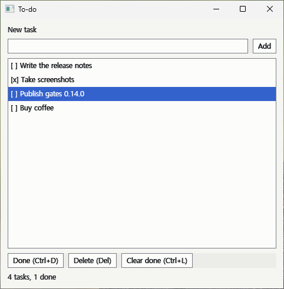
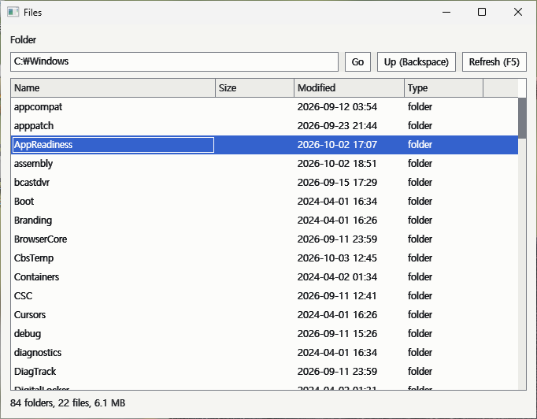
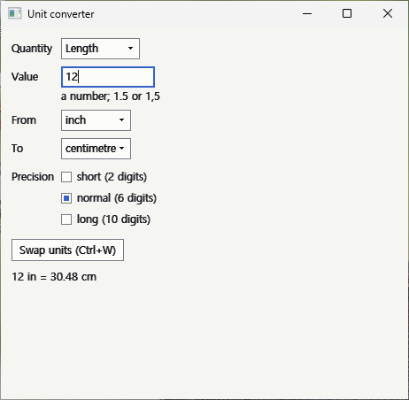
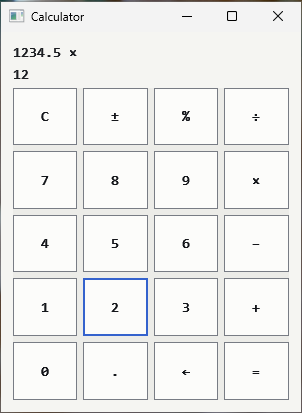
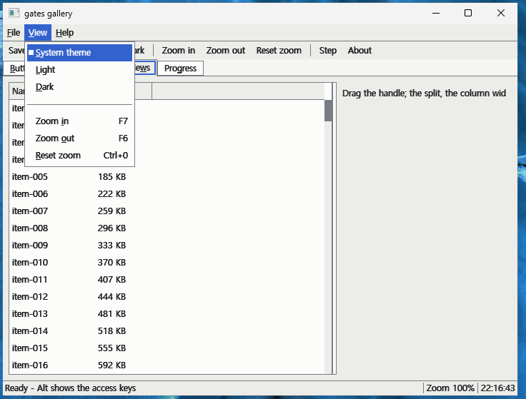

**한국어** | [English](README.md) — **Gates GUI Library v0.2.0** — [ZIP(examples Windows x64)](https://github.com/rubidus-api/gates_gui_lib/releases/download/v0.2.0/gates-0.2.0-examples-win64.zip) · [ZIP(SDK)](https://github.com/rubidus-api/gates_gui_lib/releases/download/v0.2.0/gates-0.2.0-sdk.zip) · [ZIP(source)](https://github.com/rubidus-api/gates_gui_lib/releases/download/v0.2.0/gates-0.2.0-src.zip)

# Gates GUI Library

도구형 Windows 프로그램(설정 창, 기록 살펴보기, 로그 보기, 파일 탐색, 빌드 도구)을 위한 C23 의
작은 유지형(retained) GUI 라이브러리입니다. 판은 **0.4.0** 입니다(최신 릴리스는 0.2.0).

| | |
|---|---|
|  |  |
| `app_todo` - 할 일 목록 | `app_files` - 작업 스레드가 채우는 폴더 탐색기 |
|  |  |
| `app_converter` - 입력하는 대로 바꾸는 폼 | `app_calculator` - 버튼과 키보드 |



`gallery` - 응용 프로그램 틀: 접근 키가 있는 메뉴 막대, 도구 막대, 탭, 분할 안의 표, 시계가 있는 상태 줄.

스크린샷은 `examples/` 의 예제 응용을 Windows 11 에서 실행한 모습입니다.

## 무엇인가요

gates 는 그림이 아니라 상호작용의 층입니다. 프로그램은 사람에게 필요한 것 - 보여 줄 정보,
고를 거리, 고칠 값, 실행할 명령, 알릴 진행 - 을 역할과 상태와 배치 의도를 가진 노드의 트리로
말합니다. gates 는 그것을 플랫폼의 GUI 로 사람에게 전하고, 사람의 답을 이벤트로 돌려줍니다.
HTML 과 CSS 를 떠올리시면 됩니다. 문서는 무엇이 무엇인지를 말하고, 마지막 모습은 백엔드와
테마가 정합니다. 기능이 끝났다는 것은 그 상호작용이 동작한다는 뜻입니다. 닿을 수 있고,
포인터·키보드·입력기로 쓸 수 있고, 화면 읽기 프로그램이 읽을 수 있어야 합니다.

담긴 것:

- **비례폭 글자** - 기본은 플랫폼의 UI 글꼴, 열을 맞춰야 하는 곳은 노드마다 고정폭 글꼴. 어느 쪽이든
  캐럿, 고른 범위, 누른 자리가 정확합니다.
- **컨트롤과 배치** - 이름표, 버튼, 체크박스, 한 줄 텍스트 상자, 라디오 그룹, 선택 상자, 진행
  막대, 구분선; 가로·세로·겹침·나눔·스크롤·폼 배치. 모든 좌표는 논리 단위(1/96 인치)이고
  모니터마다 배율이 맞춰집니다.
- **글자 입력** - 설치된 IME(한국어, 일본어, 중국어 ...)가 모든 텍스트 상자에서 바로 조합되고,
  클립보드, 되돌리기, 읽기 전용·비밀번호 상자, 소리 없이 자르지 않고 물어보는 길이 한도가
  있습니다.
- **폼, 명령, 대화상자, 메뉴** - 도움말과 오류 줄이 있는 이름표 달린 필드, 버튼·단축키·문맥
  메뉴가 함께 쓰는 명령 하나, 중첩 루프 없는 모달 대화상자.
- **내 데이터 위의 뷰** - 크기에 상관없이 노드 하나인 목록·표·트리·로그. 화면에 보이는 줄만
  읽고, 고른 것은 항목 id 로 지킵니다.
- **작업 스레드와 타이머** - 작업 스레드의 결과를 넘기는, 막히지 않고 한도가 있는 송신자;
  노드와 함께 취소되는 타이머.
- **테마와 접근성** - 시스템을 따르는 밝게·어둡게·고대비; UI Automation 제공자여서 내레이터와
  자동화 도구가 모든 컨트롤을 읽고 쓸 수 있습니다; 강제 규칙(이름, 24 x 24 목표, 키보드 도달,
  대비, 포커스 표시)의 감사.

브라우저 엔진도, 게임 UI 도, 픽셀까지 똑같이 그리는 도구도 아닙니다. 0.4.0 의 백엔드는
소프트웨어 그리기를 쓰는 Win32 하나이고, 코어는 플랫폼에 묶이지 않은 C23 이라 어디서나
시험이 돕니다.

## 내려받기

[릴리스 페이지](https://github.com/rubidus-api/gates_gui_lib/releases)에서 받으실 수 있습니다.

| 파일 | 내용 |
|---|---|
| `gates-<판>-examples-win64.zip` | 모든 예제를 바로 실행되는 Windows 10/11 x64 프로그램으로 - 설치 없음 |
| `gates-<판>-sdk.zip` | 패키지: 헤더, 정적 라이브러리(mingw-w64 용 `lib/win64`), 매뉴얼, 외부 빌드 예제 |
| `gates-<판>-src.zip` | 소스 코드 |

## 첫 프로그램

영어판 README 의 "A first program" 과 매뉴얼 [0장](manual-ko/manual-00-start-here-ko.md)에
창 하나와 버튼 하나로 된 첫 프로그램과 빌드 명령이 있습니다. SDK 로 빌드할 때 링크 줄은
다음과 같습니다.

```sh
x86_64-w64-mingw32-gcc -std=c23 -O2 -Igates-0.4.0/include hello.c -Lgates-0.4.0/lib/win64 \
    -lgates -lproven -lgdi32 -luser32 -limm32 -ldwmapi -ladvapi32 -luiautomationcore \
    -lole32 -loleaut32 -luuid -mwindows -o hello.exe
```

## 소스에서 빌드하기

C23 컴파일러(GCC 14 이상 또는 Clang 18 이상)와 `make` 가 필요하고, Windows 프로그램에는
mingw-w64(GCC 14 이상, Linux 또는 MSYS2)가 필요합니다.

```sh
make test           # 코어 시험(gcc); clang 은 make test CC=clang
make win            # 모든 예제를 Windows 프로그램으로, build/win/ 에
make dist           # 패키지: dist/gates-<판>/ (헤더, 라이브러리, 매뉴얼)
make dist-bin       # 예제 실행 파일: dist/gates-<판>-examples-win64/
make install PREFIX=/some/dir
make package-check  # 패키지만으로 외부 프로그램이 빌드되는지 확인
make manual-check   # 매뉴얼의 모든 프로그램이 빌드되는지(창 없는 것은 실행까지) 확인
```

gates 와 기반 라이브러리 proven 은 따로 된 정적 라이브러리입니다. Windows 에서는
`-lgates -lproven` 과 위의 Windows 라이브러리를, 창 없이 쓸 때는 어느 시스템에서든
`-lgates_core -lproven -lm` 을 링크합니다.

## 문서

- [매뉴얼](manual-ko/manual-ko.md)(한국어)과 [Manual](manual/manual.md)(영어): 첫 프로그램부터
  배포와 문제 해결까지. 매뉴얼에 실린 프로그램은 모두 빌드가 컴파일합니다. 두 판이 어긋나면
  영문판이 기준입니다.
- [examples/README.md](examples/README.md): 컨트롤마다 하나씩인 예제, 참조 응용과 예제 응용,
  손으로 확인할 것.
- `include/gates/*.h`: 공개 API. 헤더마다 첫머리에 쓰임과 규칙이 있습니다.
- [CHANGELOG.md](CHANGELOG.md): 바뀐 것.

## 상태

0.4.0 은 숫자 입력(스핀 상자, 슬라이더), 접을 수 있는 그룹 상자, 격자와 줄바꿈 배치, 담는 노드로의 이벤트 버블링, 미룬 호출을 더했습니다.
0.3.0 은 응용 프로그램 틀을 더했습니다. 메뉴 막대, 도구 막대, 상태 줄, 탭, 툴팁, Alt+글자 접근 키,
프로그램이 다시 묶을 수 있는 키맵, 배치 저장(분할, 탭, 열, 창 위치)이며 `gallery` 예제가 모두 보여 줍니다.
0.2.0 은 고정폭 제한을 풀었습니다. 글은 시스템의 비례폭 UI 글꼴로 쓰이고, 로그와 코드처럼
열을 맞춰야 하는 곳은 노드마다 고정폭 글꼴을 고를 수 있습니다. 코어 시험(약 1만 개 검사)이 GCC 와 Clang, AddressSanitizer 와
UndefinedBehaviorSanitizer 아래에서 통과하고, 모든 예제가 mingw-w64 로 경고 없이 빌드됩니다.
입력, 한국어 IME, 테마와 배율, UI Automation 과 내레이터, 예제 프로그램 같은 상호작용은
Windows 11 에서 확인했습니다. 마이너 판이 같은 릴리스끼리는 소스가 호환되지만 바이너리 호환은 아직
약속하지 않으므로, 판이 바뀔 때마다 다시 빌드해 주세요.

## 라이선스

MIT - [LICENSE](LICENSE) 를 보세요. `vendor/proven/`(proven_c_lib, MIT)과
`vendor/font8x8/`(퍼블릭 도메인)은 고치지 않고 들여왔으며, 저마다 출처와 판을 적은
`VENDORED.md` 가 있습니다.
